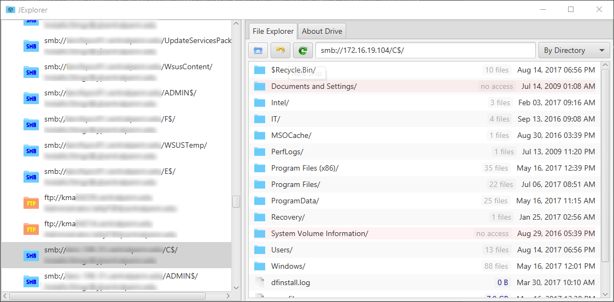

#  JExplorer


Java File Explorer that combines traversing local drives with FTP and SMB network location scanning.



* Scan network IPs and IP ranges for FTP (21) and SMB (137, 138, 139, 445) locations with provided credentials.
* Attempts all credentials with open-port systems and displays successful connections in a selectable list.
* Folders are inspected for content counts to make better decisions.
* Files and folders on all local, FTP, and Samba connections can be copied/saved locally or deleted.
* Comments in credential and network lists.

## Download

[](https://github.com/mattwright324/jexplorer/releases)

Be sure to have at least Java 11 installed.

Extract the latest release zip file and run `jexplorer-yyyyMMdd.HHmmss.jar`.

## Build

Use the clean build commands to test a build. Use the run command to build and run.

```sh
$ ./gradlew clean build
$ ./gradlew run
```

## Package

Run the package command then zip up the `build/package` folder contents for a release.

```sh
$ ./gradlew packageJar
```

## Configuration
Configuration will only affect network scanning and not drive discovery on the local system.

**Credentials** are listed in the format [username]:<password]>|\<domain>. Usernames are required followed by a semicolon. Passwords are not in the case of blank or null password sign-ins such as anonymous ftp logins. Acceptable examples:
* administrator:
* administrator:|localdomain
* LocalAdmin:123456
* NetworkAdmin:21345|localdomain

**Network Locations** are listed in single IP, single name, network range, or CIDR formats. Acceptable examples:
* 192.168.1.1
* 192.355.2.1  // Overflowing segments greater than 255 are added onto the next (left) number. Converts to '193.99.2.1'
* 192.168.1.0-192.168.1.255
* 192.168.1.0/18
* neptune-04.localdomain.com
* local-system-name
